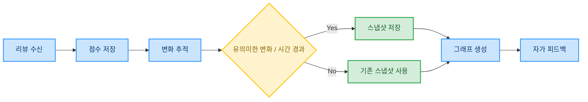

# Algoing - 개발자 맞춤형 코딩테스트 학습 플랫폼

> 2025년 1학기 한국외국어대학교 캡스톤 디자인 프로젝트

## Algoing 소개

Algoing(알고잉)은 **사용자의 풀이 이력, 코드 품질, 선호 유형** 등을 분석하여  **맞춤형 알고리즘 문제를 추천**하고, **AI 기반 코드 리뷰를 통해 개발자의 실력을 지속적으로 향상**시킬 수 있도록 설계된 **웹 기반 학습 플랫폼**입니다.

### Key Features

✅ **경험 기반 문제 추천 시스템**  
✅ **OpenAI 기반 다중 기준 코드 리뷰**  
✅ **백준 자동 제출 시스템**  
✅ **사용자 맞춤 대시보드 및 약점 분석**

## Algoing 추천 시스템

Algoing의 추천 시스템은 사용자 티어, 코드 리뷰 결과, 오답 이력 등 다양한 요소를 수치화하여 총 세 가지 전략적 방법론을 조합해 동작합니다.

### Daily Recommendation (일일 문제 추천)
 

사용자의 티어와 One-hot Encoding으로 벡터화된 선호 문제 유형을 기반으로 <b><u>코사인 유사도(Cosine Similarity)</u></b>를 계산하여, 두 요소를 종합적으로 고려한 맞춤형 문제를 추천합니다.

### Weakness Recommendation (약점 보완 추천)
 

AI의 코드 리뷰 점수를 분석하여 파악한 **사용자의 약점**에 기반해 유클리드 거리(Euclidean Distance)로 사용자의 점수와 문제 점수의 유사도 계산합니다. 선호 유형 가중치를 반영하여 맞춤형 추천이 진행됩니다.

- **FinalScore = 0.4 × typeWeightSum + 0.6 × distanceScore**

### Incorrect Problem Recommendation (오답 유형 기반 추천)
 

사용자의 누적 제출 데이터를 분석해, **정답률이 낮은 문제 유형**을 선별합니다. 이후 자카드 유사도(Jaccard Similarity)를 기반으로 해당 유형과 구조적으로 유사한 문제를 추출해 추천합니다.

## Algoing 코드 리뷰 시스템
OpenAI를 활용한 코드 정적 분석 결과는 아래 세 가지 기준의 점수와 AI 리뷰로 구성되며, 이는 개인 맞춤 문제 추천과 실력 향상 경로 추적에 핵심적으로 활용됩니다.

### 평가 기준
| 평가 항목 | 설명                                  |
| -------- | ----------------------------------- |
| 🧾 가독성 (Readability)    | 변수 및 함수명, 코드 흐름, 포맷, 구조적 명확성        |
| ⚙️ 최적성 (Optimization)   | 시간·공간 복잡도, 반복 로직, 자료구조 선택            |
| ♻️ 중복성 (Duplicate)       | 유사 로직 탐지, 불필요한 코드, 추상화 가능성         |

##  Algoing 학습 모니터링 시스템

Algoing은 사용자의 알고리즘 학습 과정을 단순 로그 수집이 아닌, 의미 기반 성장 데이터로 해석합니다. AI 코드 리뷰 결과를 분석하여, 시간에 따른 코드 품질 변화와 약점 개선 흐름을 시각화합니다.

- 시간에 따른 코드 품질 변화 및 약점 개선 경향 시각화
- 주요 지표 시각화를 통해 자기 주도형 피드백 루프 형성 지원

## 서비스 화면 예시

<h3>메인 화면</h3>

<h3>문제 추천 페이지</h3>

<h3>문제 풀이 페이지</h3>

<h3>AI 코드리뷰 & 제출 결과</h3>

<h3>마이 페이지</h3>

## 프로젝트 구조도

### User Flow

### 인프라 구조도

### Frontend
- Next.js
- Tailwind CSS
- TypeScript
- Zustand, TanStack Query
- pnpm
- Playwright

### Backend

- Spring Boot, Java 17, JPA
- MySQL
- OAuth2, JWT
- FAST API
- Playwright

### Infra & Deployment

- AWS
- GitHub Actions (CI/CD)
- Vercel

